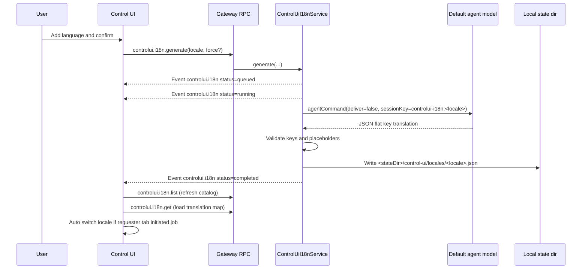
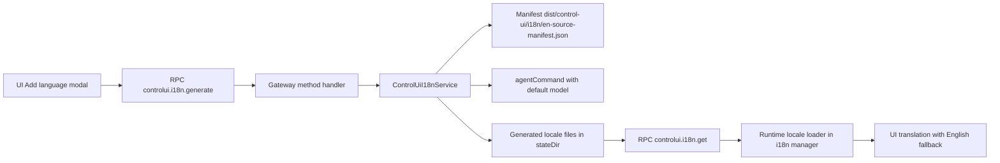
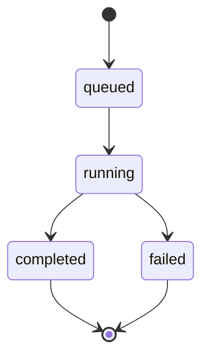

# Control UI AI i18n

This page explains the on-demand translation system for the browser Control UI.
The goal is to let operators generate new UI languages at runtime without shipping new bundles.

## Quick model

- Bundled locales are immediately available: `en`, `zh-CN`, `zh-TW`, `pt-BR`.
- Additional locales are generated on demand with the gateway default agent model.
- Generated locale files are stored locally on the gateway host.
- The UI loads generated locales at runtime and falls back to English for missing keys.

## End to end flow



## Architecture components



## Gateway data artifacts

- English source manifest (build output):
  - `dist/control-ui/i18n/en-source-manifest.json`
- Generated locale files (gateway local state):
  - `<stateDir>/control-ui/locales/<canonical-locale>.json`

Generated locale file shape:

```json
{
  "schemaVersion": 1,
  "locale": "uk",
  "sourceLocale": "en",
  "sourceHash": "<sha256>",
  "generatedAtMs": 0,
  "updatedAtMs": 0,
  "translation": {}
}
```

## Job lifecycle



Rules:

- One active job per locale (deduped).
- Different locales can run in parallel.
- Event channel: `controlui.i18n`.
- Requester tab receives start or success or failure notices; all tabs refresh catalog.

## Validation guarantees

Before writing a generated locale, gateway validates:

- Output is valid JSON object.
- Output keys exactly match English manifest keys.
- Every translated value is a non-empty string.
- Placeholder tokens like `{time}` exactly match source tokens.

If any check fails, job becomes `failed` and previous locale file remains unchanged.

## Stale detection and regenerate

- Every generated file stores `sourceHash` from the English manifest.
- `controlui.i18n.list` marks locale as `stale` when file hash differs from current manifest hash.
- UI shows `Stale` badge and allows `Regenerate`.

## Runtime loading in UI

- UI keeps bundled locale lazy-load behavior.
- Generated locale loading uses `controlui.i18n.get` via a runtime loader hook.
- Saved non-bundled locale is preserved in local settings.
- If disconnected, UI can show English temporarily and switch after reconnect and load.

## Add language UI behavior

- Main language dropdown shows only currently available locales.
- `Add language` opens searchable catalog modal.
- Generate and Regenerate are supported.
- No custom locale code input in this version.
- No delete locale action in this version.

## Troubleshooting

### Unknown method controlui.i18n.generate

Error example:

`Failed to start translation: unknown method: controlui.i18n.generate`

This means UI and gateway binaries are out of sync.

Fix:

1. Run gateway from a build that includes the new methods.
2. Restart gateway on the expected port.
3. Hard refresh browser so UI and WS session reconnect cleanly.

Useful checks:

- `openclaw channels status --probe`
- Verify running process points to the expected `openclaw` install path.

### Some UI text stays English

Common causes:

- Text is a new hardcoded literal not captured by manifest generation yet.
- Locale file is stale after English source updates.

Fix path:

1. Ensure UI string is in i18n keys or manifest-extracted literals.
2. Rebuild UI assets: `pnpm ui:build`.
3. Regenerate locale from Add language modal.

## Main source files

- Gateway service: `src/gateway/control-ui-i18n.ts`
- Gateway methods: `src/gateway/server-methods/control-ui-i18n.ts`
- Protocol schema: `src/gateway/protocol/schema/i18n.ts`
- UI controller: `ui/src/ui/controllers/control-ui-i18n.ts`
- UI modal: `ui/src/ui/views/i18n-language-modal.ts`
- Runtime i18n manager: `ui/src/i18n/lib/translate.ts`
- Manifest build plugin: `ui/vite.config.ts`
